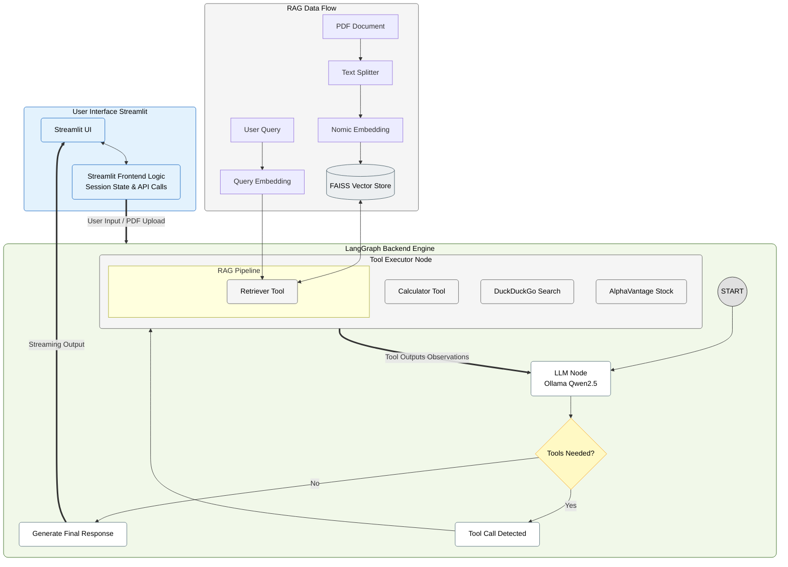

# Rexona AI: Multi-Tool Intelligence Engine

Rexona AI is a private, local-first AI assistant designed to provide intelligent document interaction and real-time utility through a multi-agent orchestration framework. Built using **LangGraph** and **Streamlit**, it integrates Retrieval-Augmented Generation (RAG) with a suite of external tools to deliver accurate, context-aware responses.

## 🚀 Key Features

* **Local-First Intelligence:** Utilizes `Ollama` (Qwen2.5) for LLM processing and `nomic-embed-text` for embeddings, ensuring data privacy by keeping computations on your local machine.
* **Advanced RAG Capabilities:** Upload PDF documents to chat with them. The system uses `FAISS` for vector storage and `RecursiveCharacterTextSplitter` to ensure high-quality context retrieval.
* **Multi-Agent Toolset:**
    * **Search:** Real-time web access via DuckDuckGo.
    * **Finance:** Live stock price fetching using the AlphaVantage API.
    * **Mathematics:** Built-in calculator for precise arithmetic.
* **Persistent Conversations:** Managed chat threads using an `InMemorySaver` checkpointer, allowing users to switch between different discussion contexts seamlessly.
* **Modern UI:** A clean, reactive Streamlit interface featuring real-time tool-execution status updates and message streaming.

## 🛠️ Tech Stack
* **Orchestration:** LangGraph
* **LLM & Embeddings:** Ollama (LangChain-Ollama)
* **Frontend:** Streamlit
* **Vector Database:** FAISS
* **PDF Processing:** PyPDF & LangChain Document Loaders

## 🏗️ System Architecture


## 📋 Prerequisites

Before running the application, ensure you have the following installed:
1.  **Python 3.9+**
2.  **Ollama:** Installed and running locally.
    * Pull the required models:
        ```bash
        ollama pull qwen2.5
        ollama pull nomic-embed-text
        ```

## ⚙️ Installation & Setup

1.  **Clone the repository:**
    ```bash
    git clone https://github.com/MridulMalvi/Rexona-AI.git
    cd Rexona-AI
    ```

2.  **Create and activate a virtual environment:**
    ```bash
    python -m venv myenv
    # Windows
    myenv\Scripts\activate
    # Linux/Mac
    source myenv/bin/activate
    ```

3.  **Install dependencies:**
    ```bash
    pip install -r requirements.txt
    ```

4.  **Environment Variables:**
    Create a `.env` file in the root directory and add your API keys:
    ```env
   ALPHAVANTAGE_API_KEY=your_api_key_here
    ```
## 🚀 Running the Application

Start the Streamlit server:
```bash
streamlit run frontend.py
