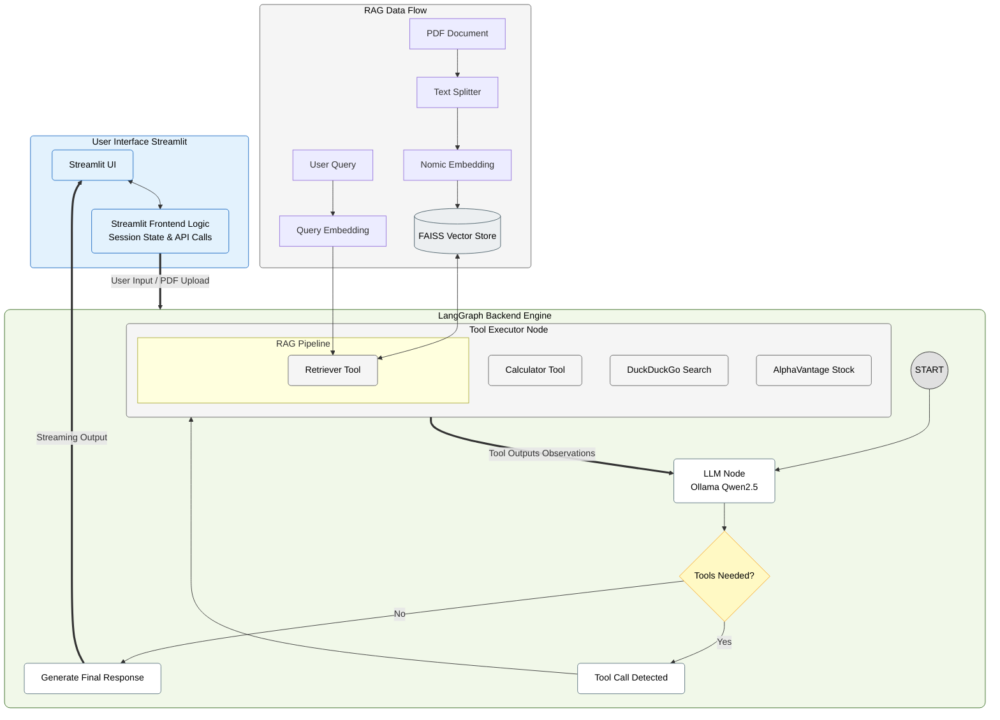

# Rexona AI: Multi-Tool Intelligence Engine

Rexona AI is a private, local-first AI assistant designed to provide intelligent document interaction and real-time utility through a multi-agent orchestration framework. Built using **LangGraph** and **Streamlit**, it integrates Retrieval-Augmented Generation (RAG) with a suite of external tools to deliver accurate, context-aware responses.

## 🚀 Key Features

* **Local-First Intelligence:** Utilizes `Ollama` (Qwen2.5) for LLM processing and `nomic-embed-text` for embeddings, ensuring data privacy by keeping computations on your local machine.
* **Advanced RAG Capabilities:** Upload PDF documents to chat with them. The system uses `FAISS` for vector storage and `RecursiveCharacterTextSplitter` to ensure high-quality context retrieval.
* **Multi-Agent Toolset:**
    * **Search:** Real-time web access via DuckDuckGo.
    * **Finance:** Live stock price fetching using the AlphaVantage API.
    * **Mathematics:** Built-in calculator for precise arithmetic.
* **Persistent Conversations:** Managed chat threads using an `InMemorySaver` checkpointer, allowing users to switch between different discussion contexts seamlessly.
* **Modern UI:** A clean, reactive Streamlit interface featuring real-time tool-execution status updates and message streaming.
* **Docker-Ready:** Fully containerized with Docker Compose for one-command deployment.

### 📸 Application Screenshots

<br>


## 🛠️ Tech Stack
* **Orchestration:** LangGraph
* **LLM & Embeddings:** Ollama (LangChain-Ollama)
* **Frontend:** Streamlit
* **Vector Database:** FAISS
* **PDF Processing:** PyPDFloader & LangChain Document Loaders
* **Containerization:** Docker & Docker Compose

## 🏗️ System Architecture

```mermaid
flowchart TD
    %% --- Styling Definitions ---
    classDef frontend fill:#e3f2fd,stroke:#1565c0,color:black,rx:5,ry:5;
    classDef engine fill:#f1f8e9,stroke:#33691e,color:black,rx:10,ry:10;
    classDef logic fill:#fff,stroke:#546e7a,color:black,rx:5,ry:5;
    classDef decision fill:#fff9c4,stroke:#f9a825,color:black,rx:5,ry:5,diamond;
    classDef tool fill:#f5f5f5,stroke:#616161,color:black,rx:5,ry:5;
    classDef storage fill:#eceff1,stroke:#455a64,color:black,shape:cyl;
    classDef terminal fill:#e0e0e0,stroke:#212121,color:black,rx:15,ry:15;

    %% --- Frontend Layer ---
    subgraph Frontend [User Interface Streamlit]
        UI[Streamlit UI]:::frontend
        Logic[Streamlit Frontend Logic\nSession State & API Calls]:::frontend
        UI <--> Logic
    end

    %% --- Connecting Frontend to Backend ---
    Logic ==> |User Input / PDF Upload| LangGraphEngine
    FinalResponse ==> |Streaming Output| UI

    %% --- Backend Layer (LangGraph) ---
    subgraph LangGraphEngine [LangGraph Backend Engine]
        direction TB
        START((START)):::terminal --> LLM[LLM Node\nOllama Qwen2.5]:::logic
        
        LLM --> Condition{Tools Needed?}:::decision
        
        %% Path 1: No tools needed, generate final response
        Condition -- No --> FinalResponse[Generate Final Response]:::logic

        %% Path 2: Tools needed, execute tools
        Condition -- Yes --> ToolCallDetected[Tool Call Detected]:::logic
        
        subgraph ToolExecutor [Tool Executor Node]
            direction LR
            Calc[Calculator Tool]:::tool
            Search[DuckDuckGo Search]:::tool
            Stock[AlphaVantage Stock]:::tool
            
            subgraph RAG [RAG Pipeline]
                Retriever[Retriever Tool]:::tool
            end
        end
        
        ToolCallDetected --> ToolExecutor
        
        %% Crucial: The Feedback Loop
        ToolExecutor ==> |Tool Outputs Observations| LLM
    end
    
    %% --- External RAG Components ---
    subgraph RAG_Data [RAG Data Flow]
        direction LR
        DocInput[PDF Document] --> Splitter[Text Splitter] --> EmbedDoc[Nomic Embedding] --> VectorDB[(FAISS Vector Store)]:::storage
        VectorDB <--> Retriever

        UserInput[User Query] --> EmbedQuery[Query Embedding] --> Retriever
    end

    %% Apply styles to main containers
    class LangGraphEngine engine;
    class Frontend frontend;
    class ToolExecutor tool;
    class RAG_Data tool;
```

## 📋 Prerequisites

Before running the application, ensure you have the following installed:

1.  **[Docker](https://docs.docker.com/get-docker/)** (includes Docker Compose on modern installs)
2.  **[Docker Compose](https://docs.docker.com/compose/install/)** (if not bundled with your Docker version)

> That's it — no Python, no virtual environments, no manual Ollama setup needed on the host.

## ⚙️ Installation & Setup

### Common Steps

1.  **Clone the repository:**
    ```bash
    git clone https://github.com/MridulMalvi/Rexona-AI.git
    cd Rexona-AI
    ```

2.  **Create a `.env` file** in the project root with your API key:
    ```bash
    ALPHAVANTAGE_API_KEY=your_api_key_here
    ```

---

### 🐳 Option A — Docker (Recommended)

> No Python, no virtual environments, no manual Ollama setup needed on the host.

3.  **Build the Docker image:**
    ```bash
    docker build -t rexona-ai .
    ```
    This creates the `rexona-ai:latest` image from the included `Dockerfile`. The first build may take a few minutes while dependencies are installed.

4.  **Start all services with Docker Compose:**
    ```bash
    docker compose up -d
    ```
    This spins up two containers:
    - `rexona-app` — the Streamlit application (port **8501**)
    - `rexona-ollama` — the Ollama LLM server (port **11434**)

5.  **Pull the required AI models** into the running Ollama container:
    ```bash
    docker exec -it rexona-ollama ollama pull qwen2.5
    docker exec -it rexona-ollama ollama pull nomic-embed-text
    ```
    > **Note:** Models are downloaded once and persisted in a Docker volume (`ollama_data`), so they survive container restarts.

6.  **Open the app** in your browser:
    ```
    http://localhost:8501
    ```

---

### 💻 Option B — Manual / Local Setup

> Use this if you prefer running without Docker or need to develop locally.

3.  **Install [Ollama](https://ollama.com/)** on your machine and pull the required models:
    ```bash
    ollama pull qwen2.5
    ollama pull nomic-embed-text
    ```

4.  **Create and activate a Python virtual environment:**
    ```bash
    python -m venv myenv
    # Windows
    myenv\Scripts\activate
    # macOS / Linux
    source myenv/bin/activate
    ```

5.  **Install Python dependencies:**
    ```bash
    pip install -r requirements.txt
    ```

6.  **Run the application:**
    ```bash
    streamlit run frontend.py
    ```

7.  **Open the app** in your browser:
    ```
    http://localhost:8501
    ```

---

## 🔄 Useful Docker Commands

| Command | Description |
|---|---|
| `docker compose up -d` | Start all services in the background |
| `docker compose down` | Stop and remove all containers |
| `docker compose up -d --build` | Rebuild the app image and restart |
| `docker compose logs -f rexona-app` | Stream application logs |
| `docker compose logs -f ollama` | Stream Ollama logs |
| `docker images rexona-ai` | Verify the built image |

## 🧩 Environment Variables

| Variable | Description | Required |
|---|---|---|
| `ALPHAVANTAGE_API_KEY` | API key for stock price lookups | Yes (for stock feature) |
